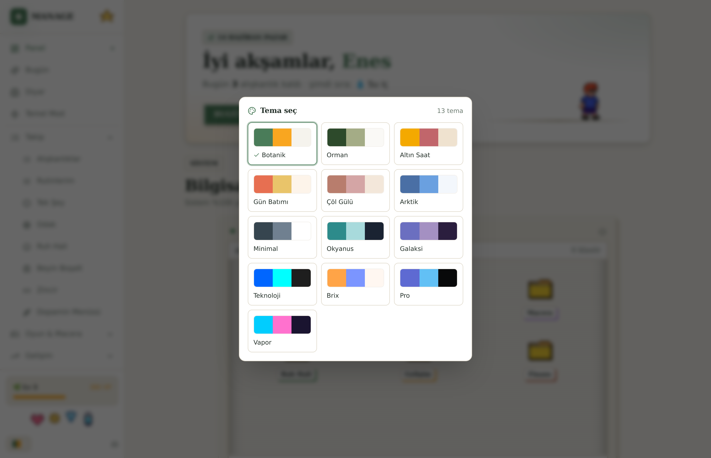
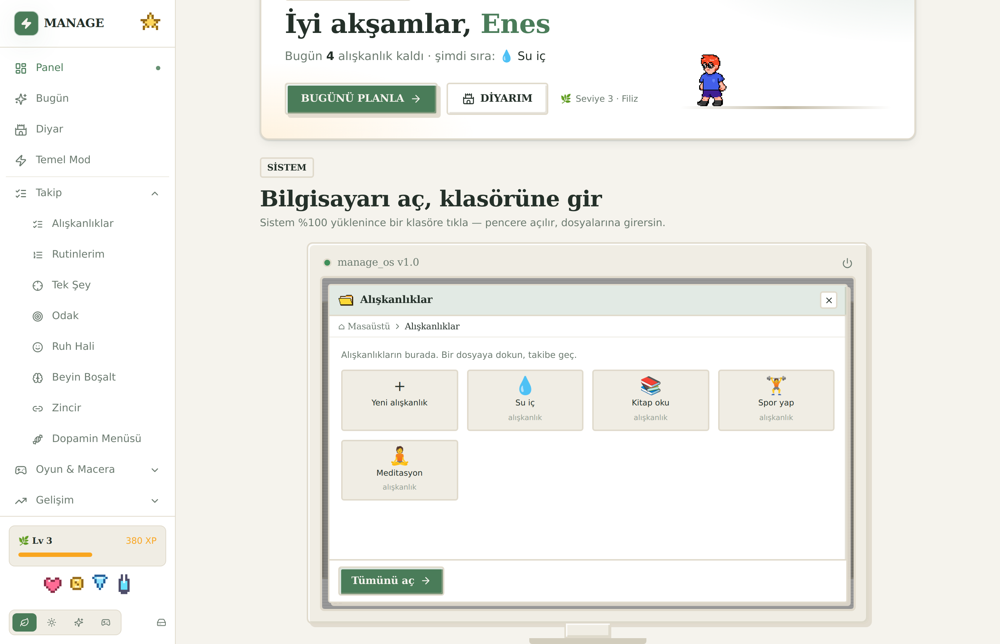
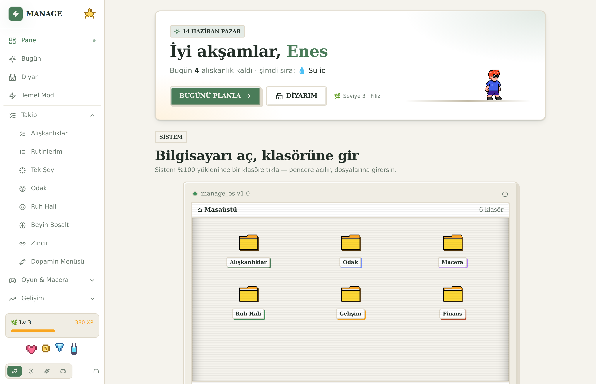
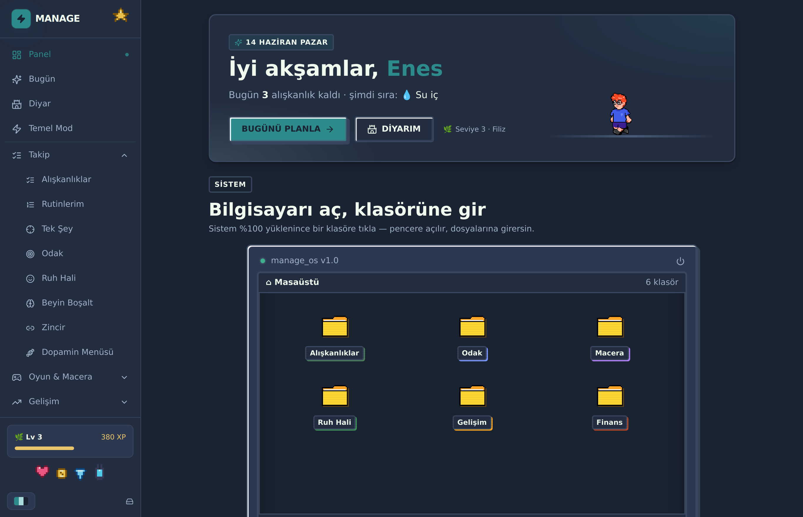

# Manage - Alışkanlık & Ödül Oyunu

DEHB zihni için tasarlanmış, oyunlaştırılmış alışkanlık takipçisi. Alışkanlık takip et, streak yap, XP kazan, seviye atla, rütbe/ünvan yükselt, 90 başarımı topla, ödülleri aç.

## Ekran görüntüleri

| Tema galerisi (13 tema) | Klasör penceresi (mini-OS) |
| --- | --- |
|  |  |

| Botanik (varsayılan) | Okyanus (koyu) |
| --- | --- |
|  |  |

## Öne çıkanlar

- **13 tema, tek tıkla:** Botanik (varsayılan), Orman, Altın Saat, Gün Batımı, Çöl Gülü, Arktik, Minimal, Okyanus, Galaksi, Teknoloji, Brix (pixel-retro), Pro, Vapor — renk önizlemeli galeriden seçilir. (theme-factory preset'leri token sistemine uyarlandı.)
- **Klasör "mini-OS":** panelde açılan bilgisayar (%100 boot) → sürüklenebilir klasör ikonları → tıklayınca taşınabilir/büyütülebilir pencere; içinde gerçek dosyaların (alışkanlık, ruh hali, odak, hesaplar).
- **Kayan animasyonlar:** scroll-reveal, hover etkileşimleri, liste kademeli giriş; `prefers-reduced-motion` destekli.
- **Yürüyen pixel karakter & figürler:** hero'da ve yan panelde 8-bit sprite'lar.
- **Odak (Pomodoro):** 15/25/45/60 dk seanslar, dakika başına XP, odak istatistiği.
- **Ruh Hali:** günlük 5 seviyeli ruh hali kaydı, son 14 gün renkli izleme, günlük XP.
- **Genişletilmiş ödül mağazası:** 5 seviyeli (Küçük → Mitik) ödüller, kilitli ödüllerde ilerleme barı.
- **Sürpriz Kutu:** XP karşılığı rastgele ödül (jackpot şansı).
- **Kartlar ve barlar:** kategori dağılımı ve istatistik barları.
- **Su takibi:** günlük bardak sayacı, hedefe ulaşınca XP (panelde widget).
- **Görev parçalama:** her alışkanlığı küçük adımlara böl, günlük checklist olarak işaretle.
- **Tarayıcı bildirimleri:** sunucusuz hatırlatıcı saatleri (uygulama açıkken).
- **Konfeti & haptik:** tamamlamada kutlama efekti, dış paket yok.
- **Tek Şey modu:** her seferinde tek göreve odaklanan sade ekran.

## Çalıştırma

```bash
npm install      # ilk seferde (yeni paket eklendiyse tekrar)
npm run dev      # http://localhost:3000
```

> Not: Bu sürümde yeni bir paket (`@supabase/supabase-js`) eklendi. Kodu güncelledikten sonra **bir kez** `npm install` çalıştırman gerekir.

## Mobil (iOS) / App Store

Web uygulaması Capacitor ile native iOS uygulamasına paketlenir. Tüm adımlar ve
App Store metadata'sı `docs/app-store.md` ve `docs/app-store-metadata.md`
dosyalarındadır. Kısaca (Mac + Xcode gerekir):

```bash
npm run build:mobile   # statik web çıktısı -> out/
npx cap add ios        # tek sefer: ios/ projesini üretir
npm run ios            # cap sync + Xcode'da aç
```

Native modda hatırlatıcılar OS'a zamanlanır, uygulama kapalıyken de bildirim gelir.
`MOBILE_EXPORT=1` olmadan normal web/SSR build'i (`npm run build`) değişmez.

## Veri kaydı

- **Varsayılan:** Tüm veriler tarayıcının `localStorage`'ında tutulur. Hiçbir kurulum gerekmez, hemen çalışır. Veri o cihazda/tarayıcıda kalır.
- **Bulut (opsiyonel, Supabase):** Aşağıdaki adımları yaparsan veri buluta senkronlanır ve her cihazdan erişilebilir.

### Supabase kurulumu (opsiyonel)

1. https://supabase.com adresinde ücretsiz bir proje oluştur.
2. Sol menü **SQL Editor > New query** > `supabase-schema.sql` dosyasının içeriğini yapıştır > **Run**.
3. **Authentication > Providers > Anonymous sign-ins** seçeneğini aç.
4. **Project Settings > API** sayfasından `Project URL` ve `anon public` anahtarını kopyala.
5. Proje kökünde `.env.local.example` dosyasını `.env.local` olarak kopyala ve iki değeri doldur.
6. `npm run dev`'i yeniden başlat. Sol alttaki simge bulut ikonuna dönerse senkron aktiftir.

Bulut yapılandırması yoksa uygulama otomatik olarak localStorage'a düşer; hiçbir özellik kapanmaz.

## Yapı

- `src/lib/` - tipler, oyunlaştırma (XP/seviye/rütbe), 80 başarım, store mantığı, supabase senkron
- `src/hooks/useStore.ts` - merkezi durum + bildirimler
- `src/components/` - UI, grafikler, dashboard, profil, ödüller
- `src/app/` - sayfalar (Panel, Alışkanlıklar, Ödüller, Başarımlar, İstatistik, Profil)
